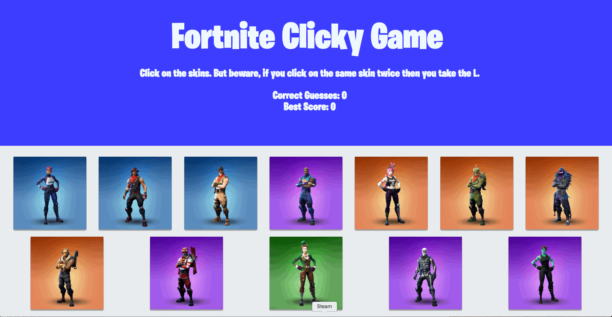

# Fortnite clickyGame

This game was created with React and deployed on [Heroku](https://fortnite-clicky.herokuapp.com/). 

## How it Works
The basis of the game is to select every skin without clicking on the same one in the game. There is a tracker to keep track of how many you got right and the highest score achieved in a gaming session. 

## React
This project was bootstrapped with [Create React App](https://github.com/facebookincubator/create-react-app).

Below you will find some information on how to perform common tasks.

## GIF of Application Functionality

